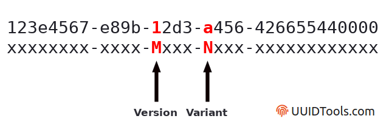

# Task 9 - The End of the Road - (Cryptanalysis, Software Development) Points: 5000

**Description:**

Unfortunately, looks like the ransomware site suffered some data loss, and doesn't have the victim's key to give back! I guess they weren't planning on returning the victims' files, even if they paid up.

There's one last shred of hope: your cryptanalysis skills. We've given you one of the encrypted files from the victim's system, which contains an important message. Find the encryption key, and recover the message.

**Downloads:**

- Encrypted file recovered from the victim's system [important_data.pdf.enc](../important_data.pdf.enc)

**Prompt:**

Enter the value recovered from the file

## Solution

We're working with the same things here as in Task 8, we have to further reverse the binary to find out how the keys are being generated and see if we can generate the same key again for our particular case.

Let's first start by using the key-encrypting-key to decrypt all the keys already in the DB. We know that the key we want isn't in there but let's see if it tells us something about any pattern in the keys.

I have a script that does this in `decrypt_enc_key.py`. It has functions to decrypt an inputted encrypted key. If we do this, we see this kind of an output:
```
b"eR/+3\t\x8c'\x89N\xb3\xc8\xe0\x0cr\xb4ee6ca29c-6e0d-11eb-b008-1762ad81\x10\x10\x10\x10\x10\x10\x10\x10\x10\x10\x10\x10\x10\x10\x10\x10"
```
The first 16 bytes are the IV that is prepended to the ciphertext. The following bytes are the plaintext. We see that the bytes after that are these:
```
ee6ca29c-6e0d-11eb-b008-1762ad81\x10\x10\x10\x10\x10\x10\x10\x10\x10\x10\x10\x10\x10\x10\x10\x10"
```
We know from using the keyMaster binary that the output gives us a plainkey like this:
```
{"plainKey":"1aa3bc56-61e3-11ed-b61d-9cb6d0b8","result":"ok"}
```
So, based on that knowledge, we can say that in the plaintext, the first segment is `ee6ca29c-6e0d-11eb-b008-1762ad81` followed by some padding `\x10\x10\x10\x10\x10\x10\x10\x10\x10\x10\x10\x10\x10\x10\x10\x10`. I don't know why this padding was added, but it doesn't matter because we can see the plainkey.

The decrypted plainkeys from the DB look like this, as a sample:
```
b'ee6ca29c-6e0d-11eb-b008-1762ad81' ,
b'55e8e185-7102-11eb-b008-1762ad81' ,
b'507a2975-ac5b-11eb-b008-1762ad81' ,
b'cb711e51-2eb8-11ec-b008-1762ad81' ,
b'b983c01c-83b6-11eb-b008-1762ad81' ,
b'c9e2eb3d-660c-11ec-b008-1762ad81' ,
b'd3d6dd42-fcd7-11eb-b008-1762ad81' ,
b'9f70a18a-8b53-11eb-b008-1762ad81' ,
b'69f603ca-326e-11ec-b008-1762ad81' ,
b'948a4b91-34c7-11ec-b008-1762ad81' ,
b'0c43f9dc-14f5-11ec-b008-1762ad81' ,
b'e46c311e-3fcd-11ec-b008-1762ad81' ,
b'444fea07-ea53-11eb-b008-1762ad81' ,
b'3da1dfc2-997f-11eb-b008-1762ad81' ,
b'd87a2502-f901-11eb-b008-1762ad81' ,
b'0094e01e-7afa-11eb-b008-1762ad81' ,
b'362a31e1-b43a-11eb-b008-1762ad81' ,
b'85fd1300-7269-11eb-b008-1762ad81' ,
b'3638e475-c858-11eb-b008-1762ad81' ,
b'c0a6e128-6afd-11eb-b008-1762ad81' ,
b'd3f8e59e-eb71-11eb-b008-1762ad81' ,
b'd36733d9-4c74-11ec-b008-1762ad81' ,
b'76982f47-886d-11eb-b008-1762ad81' ,
b'27a0d6b8-c7a3-11eb-b008-1762ad81' ,
b'd9ad7bc7-6059-11ec-b008-1762ad81' ,
b'7e12a611-ab78-11eb-b008-1762ad81' ,
b'c054ddba-9127-11eb-b008-1762ad81' ,
b'a6fd726b-76aa-11eb-b008-1762ad81' ,
b'4d7ba3f5-8f25-11eb-b008-1762ad81' ,
b'6d82c0a8-3784-11ec-b008-1762ad81' ,
b'6ca66cab-63cf-11ec-b008-1762ad81' ,
b'6bd2a0de-4ee5-11ec-b008-1762ad81' ,
b'adf62e45-2835-11ec-b008-1762ad81' ,
b'c45ce77a-fc33-11eb-b008-1762ad81' ,
b'70c84119-f544-11eb-b008-1762ad81' ,
b'287edf21-55ab-11eb-b008-1762ad81' ,
b'6b011e4a-75e4-11eb-b008-1762ad81' ,
b'efc158d1-11d3-11ec-b008-1762ad81' ,
b'04f3cd8f-6377-11eb-b008-1762ad81' ,
b'643e21a6-ba57-11eb-b008-1762ad81' ,
b'f510223a-3250-11ec-b008-1762ad81' ,
b'b18806e1-a8f8-11eb-b008-1762ad81' ,
b'fa3f4cfd-8ff8-11eb-b008-1762ad81' ,
b'6e0bd557-5df1-11eb-b008-1762ad81' ,
b'ee543ffd-e975-11eb-b008-1762ad81' ,
b'f7310de8-4df1-11eb-b008-1762ad81' ,
b'9a5f0eca-5465-11ec-b008-1762ad81' ,
b'384f7073-f896-11eb-b008-1762ad81' ,
b'adee3117-7d07-11eb-b008-1762ad81' ,
```

We can notice something interestinh here. Out of the 5part delimited by a '-', the last 2 parts remain the same and the 3rd part also almost always remains the same. The 3rd part is always either `11eb` or `11ec`.

Let's goback into Ghidra where we found the plainkey being generated. This was the function `main.DchO32CDDK0` as we saw in Task 8. I had renamed this to ` main.DchO32CDDK0_generate_plainkey_using_clockseq` for reasons we'll see inside this function.

Inside this function, we know that the plainkey is being generated so let's see what's happening inside. The function makes a call to `os.Getenv()` to get an environment variable. In Ghidra:
```
005b93cd bb 0e 00        MOV        EBX,0xe
            00 00
005b93d2 e8 09 b9        CALL       os.Getenv
            f1 ff
005b93d7 e8 a4 78        CALL       strconv.Atoi
            ec ff
005b93dc 48 85 db        TEST       RBX,RBX
```
Breaking at `0x005b93d2` in gdb and looking at arguments we see:
```
 RAX  0x6c4ae5 ◂— 0x45535f4b434f4c43 ('CLOCK_SE')
*RBX  0xe
 RCX  0x0
 RDX  0xaafc
```
The argument is in `rax`.
```
pwndbg> x/s 0x6c4ae5
0x6c4ae5:       "CLOCK_SEQUENCEGC assist waitGC worker initMB; allocated ...
```
So, the string for the environment variable name is "CLOCK_SEQUENCE". It then calls `strconv.Atoi()` which converts the value from a string to an integer.

After this, we can see in the disassembly that it moves `-0x1` into `rax` and `rcx` as the argument and then calls the function `github.com/google/uuid.SetClockSequence`.
```
005b93dc 48 85 db        TEST       RBX,RBX
005b93df 48 c7 c1        MOV        RCX,-0x1
            ff ff ff ff
005b93e6 48 0f 45 c1     CMOVNZ     RAX,RCX
005b93ea e8 31 34        CALL       github.com/google/uuid.SetClockSequence  
```
The documentation can be found here: https://github.com/google/uuid/blob/master/time.go  It says for this function that "SetClockSequence sets the clock sequence to the lower 14 bits of seq.  Setting to -1 causes a new sequence to be generated." From this we can understand that the function generates a new clock sequence value because the argument is `-0x1`.

Next, what happens is the function `github.com/google/uuid.NewUUID` is called immediately after it. Inside this function, it makes calls to `github.com/google/uuid.GetTime()` and `github.com/google/uuid.setNodeInterface()`. The function ``github.com/google/uuid.NewUUID` uses these to make a new uuid and then return it. So, the plainkeys are just uuids generated by the binary.

About how clock sequence is used in generating UUIDs: https://stackoverflow.com/questions/41475842/what-does-clock-sequence-mean We see that clock sequence has nothing to do with actual time and is more like a counter or random number. We also see that UUID consistes of 3 things:
- clock sequence
- timestamp
- place

An online resource which explains how UUIDs are generated: https://digitalbunker.dev/understanding-how-uuids-are-generated/ There is also an online utility that I found which helps decode UUIDs: https://www.uuidtools.com/decode.

Using these, we can see that the node ID is the MAC address of the device that is generating the UUID, the clock sequence is a number, and there is a timestamp.

The function `github.com/google/uuid.GetTime()` can be found here: https://github.com/google/uuid/blob/512b657a42880af87e9f0d863aa6dccf3540d4ba/time.go We see that the time returned by this is the current time but it's not a unix timestamp. It's a lillian timestamp.
```
// GetTime returns the current Time (100s of nanoseconds since 15 Oct 1582) and
// clock sequence as well as adjusting the clock sequence as needed.  An error
// is returned if the current time cannot be determined.
```
```
const (
	lillian    = 2299160          // Julian day of 15 Oct 1582
	unix       = 2440587          // Julian day of 1 Jan 1970
	epoch      = unix - lillian   // Days between epochs
	g1582      = epoch * 86400    // seconds between epochs
	g1582ns100 = g1582 * 10000000 // 100s of a nanoseconds between epochs
)
```
The `GetTime()` function calls `getTime()` internally and inside that, it calculates the current time as:
```
	now := uint64(t.UnixNano()/100) + g1582ns100
```

So, now we know how the timestamp is generated for use in an UUID. For the clock sequence, we can decode the UUIDs from the decrypted keys and see what value was being used. From the above blog explaining UUID construction, we know that the first 3 segments have the lillian timestamp and the version in the 3rd segment; and the 4th segment has the variant and clock sequence; and finally the last segment is the Node ID.
```
TimeLow + TimeMid + TimeHighAndVersion + (ClockSequenceHiAndRes && ClockSequenceLow) + NodeID
```


We can decode one of the UUIDs from before to get info from it about clock sequence used and the Node ID. The UUID will need to extended with a few zeroes: `ee6ca29c-6e0d-11eb-b008-1762ad810000`
- Standard String Format:	ee6ca29c-6e0d-11eb-b008-1762ad810000
- Single Integer Value:	316920329201540034674735145905626873856
- Version:	1 (time and node based)
- Variant:	DCE 1.1, ISO/IEC 11578:1996
- Contents - Time:	2021-02-13 15:12:47.865922.8 UTC
- Contents - Clock:	12296 (usually random)
- Contents - Node:	17:62:ad:81:00:00 (local multicast)

We have the clock sequence and the Node ID from this. However, we don't really need it because the as we saw earlier, the last 2 segments don't change at all , so we can just copy them directly without needing to parse them.

Now that we know everything that goes into making a UUID, we can forge the correct UUID for our case to use as the plainkey. What we need is:
- Clock sequence: Known from decrypted keys in DB
- Node ID: Known from decrypted keys in DB
- Timestamp (lillian): We don't know the value yet, but we know where it should go in order to form the UUID key.

Now, we need to find the time when the keys were generated. If we look in the `keygeneration.log` file, we can see that there are timestamps in it which tell us when the log was added. If we look at the corresponding decrypted UUID and extract the timestamp from the UUID, we see that it is slightly different with some offset. For example, the first row in the log has the following values:
- Date in keygeneration.log: `2021-01-03T13:32:10-05:00`
- Encrypted key: `cVU+CyY2OAZa9YO5kyyXmIANfiTv2TJ0NwYLQu6SXLhd1QrJIOnlNGAAz7PzBoYrXRlgM9pddbP2S6v/8BDsHQ==`
- Decrypted UUID: `f7310de8-4df1-11eb-b008-1762ad81`
- Timestamp extracted from UUID (lillian at 10**-7 sec precision): `138289915194576360`
- UUID timestamp, converted to unix (10**-7 sec precision): `16096987194576360`
- Difference (10**-7 sec precision)): `105423640.0`
> Note that these values seem to change depending on what timezone you're in. So, you might have to adjust for that if you're not in the same timezone as the GMT-05:00 which is used in `keygeneration.log`. It would be by some number of hours, but the seconds-level offset should be the same.

In this way, we can look for the maximum offset and the minimum offset between the time mentioned in the log file and the time extracted from the UUID. 
- max: `118353370.0` (100ns precision) ~11.8 sec
- min: `61562742.0` (100ns precision) ~6.1 sec

Now, we have an idea of how much offset there is between UUID generation (the timestamp that gets used in the UUID) and then inserting the log into the `keygeneration.log` file. We already know that the DB doesn't have the key we need but if the `keygeneration.log` file has a record of approximately when the key was generated. This gives us an idea of the timestamp to use in forging the UUID key we need. 

We can try to generate all the possible UUIDs are between the maximum and minimum offset we found and add a few seconds on each side of the bounds as margin. We can bruteforce decryption of `important_data.pdf.enc` using these generated UUIDs. If the decrypted file has teh PDF header `%PDF` at the start, then we know that the decryption was successful and we can stop bruteforcing.

However, we will first need to figure out the encryption used to encrypt the file so that we know the correct decryption technique to apply with all the UUID keys.

Where can we find this information? Task 9 just has the pdf file we need to decrypt; Task 8 had the keyMaster binary and some DBs; Tasks 6 and 7 were web exploits; Task 5 was about reversingt the ssh-agent binary; Tasks B2 and B1 were again web analysis and exploiting; Task A1 just had a vpn log; and finally Task A2 had a pcap file and file on the root home dir. Task A2 seems like a promising place to look for the information we need so let's look there.

If we analyse the pcap we decrypted earlier closely again, we can find that there is a HTTP GET request made and that there is a file being transferred. This file is called `tools.tar`. The way to download it is this:
- Follow TLS stream from the GET request for the file, then filter for the response packets (instead of entire conversation), then save the raw to a file. This would have the HTTP response header included in it, so open in text editor and just delete that starting part so that it starts at `tools/`

We now have the `tools.tar` file. Let's try and decompress it. If we try to decompress it, it's going to show errros and give corrupt files. (I spent a lot of time trying to fix it and get it to decompress). This is because the file isn't actually complete. The pcap ends before all the packets for this file are sent. We still have the partial file though. Let's just open the file in a text editor and see if we can make any interesting observations.

If we search for `tools/` inside it, we can find that there are several files:
- `tools/busybox`
- `tools/ransom.sh`
- `tools/openssl`
  
We can find the `ransom.sh` file if we look for the it by looking at the text nearby where we found `tools/ransom.sh` mentioned or if we search for `#!/bin/sh`. We see the script:
```
read -p "Enter encryption key: " key
hexkey=`echo -n $key | ./busybox xxd -p | ./busybox head -c 32`
export hexkey
./busybox find $1 -regex '.*\.\(pdf\|doc\|docx\|xls\|xlsx\|ppt\|pptx\)' -print -exec sh -c 'iv=`./openssl rand -hex 16`; echo -n $iv > $0.enc; ./openssl enc -e -aes-128-cbc -K $hexkey -iv $iv -in $0 >> $0.enc; rm $0' \{\} \; 2>/dev/null
```

`busybox` is a binary that should already be install in Ubuntu so we can directly use that.

For the IV, we see that it is generating random 16 bytes and then saving them to the `$iv` variable and then adding them to the start of the file `$0.enc` in below snippet. Here, `$0.enc` is whatever file is being encrypted, and the script searches for and ecrypts all the pdf, doc, docx, xls, xlsx, ppt, and pptx files that it can find.
```
iv=`./openssl rand -hex 16`; echo -n $iv > $0.enc;
```

The hexkey is taken from user input, `xxd` is used to convert each character into hexadecimal byte, and then truncated to length 32. This forms the `$hexkey` variable (try it yourself with a dummy value in $key such as a sample UUID). 

Now, the encryption is done using the $hexkey and the $iv. The encryption is AES-128 in CBC mode, the input is the file referred by `$0` and the output is appended to `$0.enc`. After this, the original file is deleted with `rm`. 
```
openssl enc -e -aes-128-cbc -K $hexkey -iv $iv -in $0 >> $0.enc; rm $0
```

So, now we know what the encryption is. We can extract the IV by taking the first 32 characters and parsing the hexstring into bytes. We can form the key by taking the UUID and then truncating it to have only 16 characters since each character-byte is represented using two hexadecimal digits giving a length of 32 when presented as a hexstring. We then form a bytestring from the truncated UUID, giving us the key. Next, we can use Python's Cryptography library to make an AES-128 cipher and use it to decrypt the file. The script for bruteforcing is in `enumerate_uuids_and_decrypt.py`.

We let the script run until we find the result.

The result is:
- `d5ba9787-f88b-11ec-b008-1762ad81` is the UUID key.
- The AES cipher uses this part of it: `b'd5ba9787-f88b-11'`
- The decrypted file is in `important_data.pdf`
- The answer mentioned in the pdf which we can submit to the challenge is: `eaVVbNrPhOYeOaOFBqEMTwQg49UQogff`

NSA CBC 2022 Solved !!

## Answer

`eaVVbNrPhOYeOaOFBqEMTwQg49UQogff`

> Congratulations! You've completed the 2022 Codebreaker Challenge!

