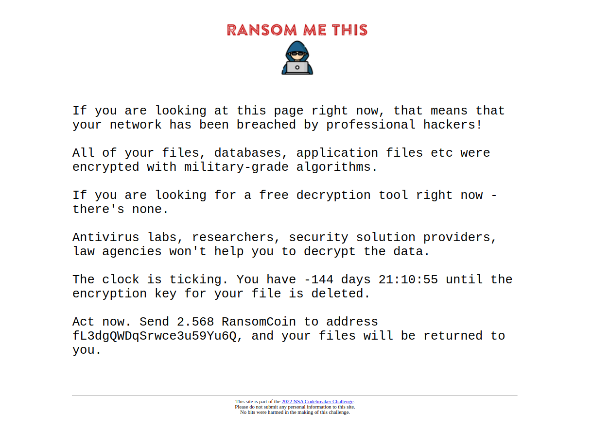
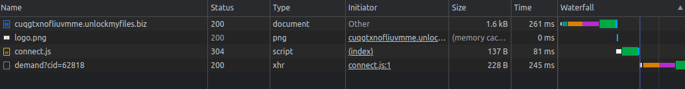
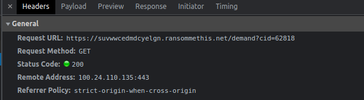

# Task B1 - Information Gathering - (Reverse Engineering, Web Analysis) Points: 10

**Description:**

The attacker left a file with a ransom demand, which points to a site where they're demanding payment to release the victim's files.

We suspect that the attacker may not have been acting entirely on their own. There may be a connection between the attacker and a larger ransomware-as-a-service ring.

Analyze the demand site, and see if you can find a connection to another ransomware-related site.

**Downloads:**

Demand note from the attacker [YOUR_FILES_ARE_SAFE.txt](../YOUR_FILES_ARE_SAFE.txt)

**Prompt:**

Enter the domain name of the associated site.

## Solution

The challenge prompt tells us that we have a ransomware demand note which directs us to the website https://cuqgtxnofliuvmme.unlockmyfiles.biz/, and we are required to find another domain which this one is supposedly connected to in some way.

There are two ways to solve this:
1. The hard way, which is what I ended up doing when I was workin on it.
2. The easy way, which I realied after solving it

### Hard way

First, we visit the page to get a sense for what the webpage is. The webpage looks like it's just there to ask for the ransom payment.


Lets' now look at the developer tools -> sources. Here, we can see that there is some javascript available in [`connect.js`](../connect.js).

The file seems to be obfuscated with the names for variables, functions, etc. being random strings. On some analysis, we can also notice that the functions call each other in difficult to follow ways where some functions are just there to call another function and so on. Using an online js deobfuscator (https://deobfuscate.io/) is not much help either.

After spending some time looking through it, we can see an array in the function `function _0x21ed()` and the array is named `const _0x8208f3`:
```
function _0x21ed() {
    const _0x8208f3 = ['elgn.ranso', 'id=62818', '203252wBODJL', 'amount', 'went\x20wrong', '439340ouTiGW', '9988UUDdKo', '2805173VXAphb', 'status', 'apply', '4962060LexVOJ', 'onload', 'response', 'search', 'mmethis.ne', 'vwwcedmdcy', '170wgcKHp', '8VGxEMo', '12402lelCqA', 'https://su', '690858ovZPLY', 'floor', 'ById', 'time', 'getTime', 'responseTy', 'json', 'getElement', 'round', 'open', '\x20days\x20', 'exp_date', '(((.+)+)+)', '198PrcoOB', 'GET', 't/demand?c', 'address', 'innerHTML', 'constructo', 'send', 'toString'];
    _0x21ed = function() {
        return _0x8208f3;
    };
    return _0x21ed();
}
```

This array seems to be a collection of broken up strings that get used in other functions and variables where hardcoded strings are needed, so they are placed into this array and then used by referencing them in difficult-to-follow ways. 

In this array we can see some interesting things. There seems to be a string which indicates a broken up web url. The string `'https://su'` gives this away because it has the protocol in it and looks like the beginning of a url. So, let's try to find other strings which might be a part of the segmented url.

The first strings is the one we found `https://su`.The next strings which looks interesting is `t/demand?c` which looks like a segment of a GET request because of the `/` and the `?` in it. Looking through the strings, the strings `mmethis.ne` and `elgn.ranso` also look interesting---the first because it seems to have the `.ne` in it which would become `.net/demand?c` when placed together, and the second because of `ranso` in it which becomes `ransommethis.net/demand?c` when placed in that position. Using the strings so far, we can construct the following url: `https://suelgn.ransommethis.net/demand?c` which looks fair enough fo our answer. So, let's try giving the domain from this:`suelgn.ransommethis.net`

It turned out to be wrong.

We are probably missing some segment of the whole url which is probably going to be before the `elgn.ranso`segment because the `ransommethis` seems to be in the correct place and so do the others. The first part of the constructed url seems to be a random-like string. So, let's look for a string segment that looks like random characters. One more thing to notice is that so far all the segments we found were of the same length:  10 characters long. So, it might be good to look for 10 character long segments. The following 2 segments look plausible because they look like random chars and are 10-char long: `9988UUDdKo` and `vwwcedmdcy`. Lets try constructing urls with these: `https://su9988UUDdKoelgn.ransommethis.net/demand?c` and `https://suvwwcedmdcyelgn.ransommethis.net/demand?c`


Let's now try each of these. It turns out the first is wrong and the second is right. The correct url is: `https://suvwwcedmdcyelgn.ransommethis.net/demand?c` and the domain: `suvwwcedmdcyelgn.ransommethis.net`.

### Easy way

The easy way is to visit the mentioned website and open developer tools window. In the network tab, when the page is loaded, there are a few connections and requests being made. 



In here, we can see that there is an interesting `demand?cid=62818` request being made. Let's look at the details for it.



We can see the url here for the GET request. It is `https://suvwwcedmdcyelgn.ransommethis.net/demand?cid=62818`


So, the domain that we want is `suvwwcedmdcyelgn.ransommethis.net` which we can give as the answer.

## Answer

> Nicely done! Looks like there is an association with another site.

