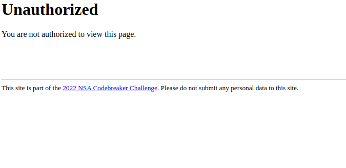
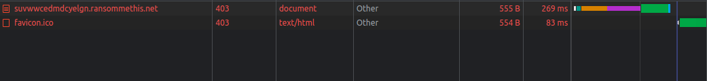
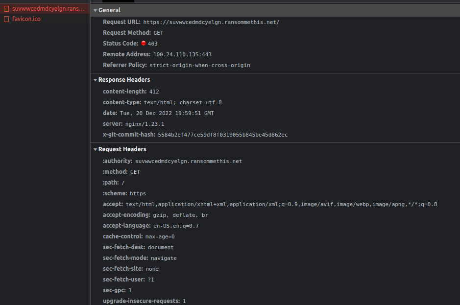
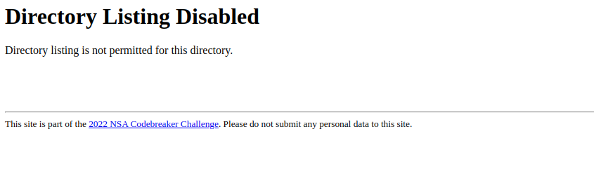
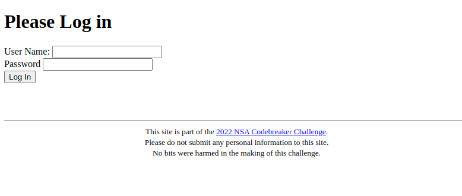

# Task B2 - Getting Deeper - (Web Hacking, [redacted]) Points: 100

**Description:**

It looks like the backend site you discovered has some security features to prevent you from snooping. They must have hidden the login page away somewhere hard to guess.

Analyze the backend site, and find the URL to the login page.

Hint: this group seems a bit sloppy. They might be exposing more than they intend to.

Warning: Forced-browsing tools, such as DirBuster, are unlikely to be very helpful for this challenge, and may get your IP address automatically blocked by AWS as a DDoS-prevention measure. Codebreaker has no control over this blocking, so we suggest not attempting to use these techniques.

**Downloads:**


**Prompt:**

Enter the URL for the login page

## Solution

> This is where things start to get a little bit more difficult.

From the previous challenge, we have the url: `https://suvwwcedmdcyelgn.ransommethis.net/demand?cid=62818`. Lets's try visiting it. We get the following response:
```
{"address":"fL3dgQWDqSrwce3u59Yu6Q","amount":2.568,"exp_date":1659195808}
```
There doesn't seem to be anything interesing in this. It is just the ransom amount and related things.

Let's try visiting the home page at `https://suvwwcedmdcyelgn.ransommethis.net/`. We get a 403 error response: We are not authorised for the page.


The response in the network tab is this:


The details are these:


In the response headers, we can see that there is the `x-git-commit-hash` header which is unusual. This might be what the hint is referring to about exposing more than intended. But we don't know what to do with this value. The git-hash header is this: `x-git-commit-hash: 5584b2ef477ce59df8f0319055b845be45d862ec`


The thing to realise here is that the *value* of the git hash\* is not that important, rather it's that the git-commit-hash tells us that the website is using git in its the source folder. It took me quite a while to realise this after trying lots of different things.

> Some of the things I tried before realising it:
> - I tried using the git hash to find if the commit could be found on github for some repository.
> - I tried lookin for a github repo using wayback machine (https://web.archive.org).

Now, once we realise that the source folder uses git, we can do some interesting things. 

The first thing to try and do is see if we can request the `.git` folder, by going to `https://suvwwcedmdcyelgn.ransommethis.net/.git`. It gives us an interesting error:


This suggests that perhaps we might still be able to request files directly instead of getting the dir listing. 

In order to see what files we can request, we can make initialise a dummy git repo in a folder and see what the `.git` folder usually contains. I did this and make a few dummy commits just to have something to work with. To get an idea of what each folder means in the `.git` dir, I found this resource: https://www.tutorialspoint.com/what-is-git-folder-and-why-is-it-hidden. The one that is of interest to us is the `objects` folder.
 
> I actually tried downloading all the files in all the folders to see what would be useful, but didn't find most of it useful. The `.git/info`, `.git/logs` and `.git/refs` folders had some interesting things such as commit info, branch info, etc. but not much more beyond that. 

The `.git/objects` folder has the git commit files which stores the information about the repository structure, additions, files, etc. and that is what is interesting to us because we can use it to see the files in the server's git repository.

The way that the `.git/objects` folder is structures is that the the commit hash is used for the subdirectories. The first two hexadecimal digits in the hash are the subdirectory name and the remaining part is the filename within that subdirectory. So, for example, the git commit hash we had from the response header was: `5584b2ef477ce59df8f0319055b845be45d862ec`, so the corresponding file is inside `.git/objects/55/84b2ef477ce59df8f0319055b845be45d862ec`. We can request this file simply by navigating to `https://suvwwcedmdcyelgn.ransommethis.net/.git/objects/55/84b2ef477ce59df8f0319055b845be45d862ec`. This gives us the file. But there's another problem: the file is in binary format and can' be read directly.

There is a command that `git` has which allows us to read files of this type: `git cat-file`. We can find this command by searching on Google for how to read git object files; I found this resource: https://git-scm.com/book/en/v2/Git-Internals-Git-Objects.

So, if we use this command to read the file, we can see this output:
```
$ git cat-file -p 5584b2ef477ce59df8f0319055b845be45d862ec
tree 14097764b87546b6039772f67767f859acb4146c
author Ransom Me This <root@ransommethis.net> 1657580052 +0000
committer Ransom Me This <root@ransommethis.net> 1659723379 +0000

Initial import
```
This tells us that there is a tree with hash: `14097764b87546b6039772f67767f859acb4146c`, so we can request this object file in the same way: `https://suvwwcedmdcyelgn.ransommethis.net/.git/objects/14/097764b87546b6039772f67767f859acb4146c`. Viewing this, we get:
```
$ git cat-file -p 14097764b87546b6039772f67767f859acb4146c
100755 blob fc46c46e55ad48869f4b91c2ec8756e92cc01057    Dockerfile
100755 blob dd5520ca788a63f9ac7356a4b06bd01ef708a196    Pipfile
100644 blob 47709845a9b086333ee3f470a102befdd91f548a    Pipfile.lock
040000 tree 3095d08c1a2943fcc939c1e73fe5feb65823d0e1    app
```
We can see that there is a tree (a folder) called `app` in the repo. Let's try getting that:
```
$ git cat-file -p 3095d08c1a2943fcc939c1e73fe5feb65823d0e1        
100755 blob e69de29bb2d1d6434b8b29ae775ad8c2e48c5391    __init__.py
100644 blob 978a7bf31ae22aa37fb137027684f640ae57c64f    server.py
040000 tree b74c07f2fa23cffe19ef8af211a820f26094a53b    templates
100644 blob 72ba86abc8077869b16b625f76138ae776883908    util.py
```
This shows us the `server.py` file which seems to be the source code for the server application. Lets' see what we get by lookin at the **blob**:
```
$ git cat-file -p 978a7bf31ae22aa37fb137027684f640ae57c64f
#!/usr/bin/env python

from datetime import datetime
from flask import Flask, jsonify, render_template, request, redirect, make_response, send_file, send_from_directory
from flask_bootstrap import Bootstrap
from os.path import realpath, exists
from . import util
import json
import os
import random
import subprocess
import sys


app = Flask(__name__)
Bootstrap(app)

def expected_pathkey():
        return "znejayfsvdnrzptm"

def forum():
        return render_template('forum.html')


def userinfo():
        """ Create a page that displays information about a user """
        query = request.values.get('user')
        if query == None:
                query =  util.get_username()
        userName = memberSince = clientsHelped = hackersHelped = contributed = ''
        with util.userdb() as con:
                infoquery= "SELECT u.memberSince, u.clientsHelped, u.hackersHelped, u.programsContributed FROM Accounts a INNER JOIN UserInfo u ON a.uid = u.uid WHERE a.userName='%s'" %query
                row = con.execute(infoquery).fetchone()
                if row != None:
                        userName = query
                        memberSince = int(row[0])
                        clientsHelped = int(row[1])
                        hackersHelped = int(row[2])
                        contributed = int(row[3])
        if memberSince != '':
                memberSince = datetime.utcfromtimestamp(int(memberSince)).strftime('%Y-%m-%d')
        resp = make_response(render_template('userinfo.html', 
                userName=userName,
                memberSince=memberSince, 
                clientsHelped=clientsHelped,
                hackersHelped=hackersHelped, 
                contributed=contributed,
                pathkey=expected_pathkey()))
        return resp


def navpage():
        return render_template('home.html')

def loginpage():
        if request.method == 'POST':
                cookie = util.login(request.form['username'], request.form['password'])
                if cookie is None:
                        # Invalid login
                        return render_template('login.html', message="Invalid login, please try again.")
                resp = make_response(redirect(f"/{expected_pathkey()}"), 302)
                resp.set_cookie('tok', cookie)
        return render_template('login.html', message="")

def adminlist():
        """ Generate the list of current admins.
                This page also shows former admins, for the sake of populating the page with more text. """
        with util.userdb() as con:
                adminlist = [row[0] for row in con.execute("SELECT userName FROM Accounts WHERE isAdmin = 1")]
                return render_template('adminlist.html',adminlist=adminlist)

def admin():
        return render_template('admin.html')

def fetchlog():
        log = request.args.get('log')
        return send_file("/opt/ransommethis/log/" + log)

def lock():
        if request.args.get('demand') == None:
                return render_template('lock.html')
        else:
                cid = random.randrange(10000, 100000)
                result = subprocess.run(["/opt/keyMaster/keyMaster", 
                                                                 'lock',
                                                                 str(cid),
                                                                 request.args.get('demand'),
                                                                 util.get_username()],
                                                                 capture_output=True, check=True, text=True, cwd="/opt/keyMaster/")
                jsonresult = json.loads(result.stdout)
                if 'error' in jsonresult:
                        response = make_response(result.stdout)
                        response.mimetype = 'application/json'
                        return response

                with open("/opt/ransommethis/log/keygeneration.log", 'a') as logfile:
                        print(f"{datetime.now().replace(tzinfo=None, microsecond=0).isoformat()}\t{util.get_username()}\t{cid}\t{request.args.get('demand')}", file=logfile)
                return jsonify({'key': jsonresult['plainKey'], 'cid': cid})

def unlock():
        if request.args.get('receipt') == None:
                return render_template('unlock.html')
        else:
                result = subprocess.run(["/opt/keyMaster/keyMaster", 
                                                                 'unlock', 
                                                                 request.args.get('receipt')],
                                                                capture_output=True, check=True, text=True, cwd="/opt/keyMaster/")
                response = make_response(result.stdout)
                response.mimetype = 'application/json'
                return response

def credit():
        args = None
        if request.method == "GET":
                args = request.args
        elif request.method == "POST":
                args = request.form
        if args.get('receipt') == None or args.get('hackername') == None or args.get('credits') == None:
                # Missing a required argument
                return jsonify({"error": "missing argument"}), 400
        result = subprocess.run(["/opt/keyMaster/keyMaster", 
                                                        'credit',
                                                        args.get('hackername'),
                                                        args.get('credits'),
                                                        args.get('receipt')],
                                                        capture_output=True, check=True, text=True, cwd="/opt/keyMaster")
        response = make_response(result.stdout)
        response.mimetype = 'application/json'
        return response

# API for payment site
@app.route("/demand")
def demand():
        d = dict()
        with util.victimdb() as con:
                row = con.execute('SELECT dueDate, Baddress, pAmount FROM Victims WHERE cid = ?', (request.args.get('cid'),)).fetchone()
                if row is not None:
                        d['exp_date'] = row[0]
                        d['address'] = row[1]
                        d['amount'] = row[2]
        resp = jsonify(d)
        resp.headers.add('Access-Control-Allow-Origin', '*')
        return resp


@app.route("/", defaults={'pathkey': '', 'path': ''}, methods=['GET', 'POST'])
@app.route("/<path:pathkey>", defaults={'path': ''}, methods=['GET', 'POST'])
@app.route("/<path:pathkey>/<path:path>", methods=['GET', 'POST'])
def pathkey_route(pathkey, path):
        if pathkey.endswith('/'):
                # Deal with weird normalization
                pathkey = pathkey[:-1]
                path = '/' + path

        # Super secret path that no one will ever guess!
        if pathkey != expected_pathkey():
                return render_template('unauthorized.html'), 403
        # Allow access to the login page, even if they're not logged in
        if path == 'login':
                return loginpage()
        # Check if they're logged in.
        try:
                uid = util.get_uid()
        except util.InvalidTokenException:
                return redirect(f"/{pathkey}/login", 302)

        # At this point, they have a valid login token
        if path == "":
                return redirect(f"/{pathkey}/", 302)
        elif path == "/" or path == 'home':
                return navpage()
        elif path == 'adminlist':
                return adminlist()
        elif path == 'userinfo':
                return userinfo()
        elif path == 'forum':
                return forum()
        elif path == 'lock':
                return lock()
        elif path == 'unlock':
                return unlock()
        # Admin only functions beyond this point
        elif path == 'admin':
                return util.check_admin(admin)
        elif path == 'fetchlog':
                return util.check_admin(fetchlog)
        elif path == 'credit':
                return util.check_admin(credit)
        # Default
        return render_template('404.html'), 404

```
This gives us the whole source code from the file. Note how this was a blob hash rather than a tree hash which we were looking at before. The blobs refer to files in the repo and the trees refer to folders in the repo. It's a tree structure where the leaves are blobs with the source, and the intermediate nodes are trees which are hashes of folders.

> I actually requested all of the folders and the files inside the `app/` folder and made a local copy of the entire source. I didn't just restrict myself to looking at `server.py` file. This came in useful in later tasks.

Now, in this source code, we can see that there is a function called `pathkey_route` which defines all the routes. Inside this, there is an expected path which it looks for where the actual website is hidden:
```
        # Super secret path that no one will ever guess!
        if pathkey != expected_pathkey():
                return render_template('unauthorized.html'), 403
```
The function `expected_pathkey` returns this:
```
def expected_pathkey():
        return "znejayfsvdnrzptm"
```

So, it would seem that the path that we need to navigate to is at `/znejayfsvdnrzptm`. Which means that we should be able to access the real website if we go to this url: https://suvwwcedmdcyelgn.ransommethis.net/znejayfsvdnrzptm. Here is what we see:


We have succeddfully found the website! Now, let's give this as the answer and claim our points.

## Answer
> Well found! Now we need to log in...